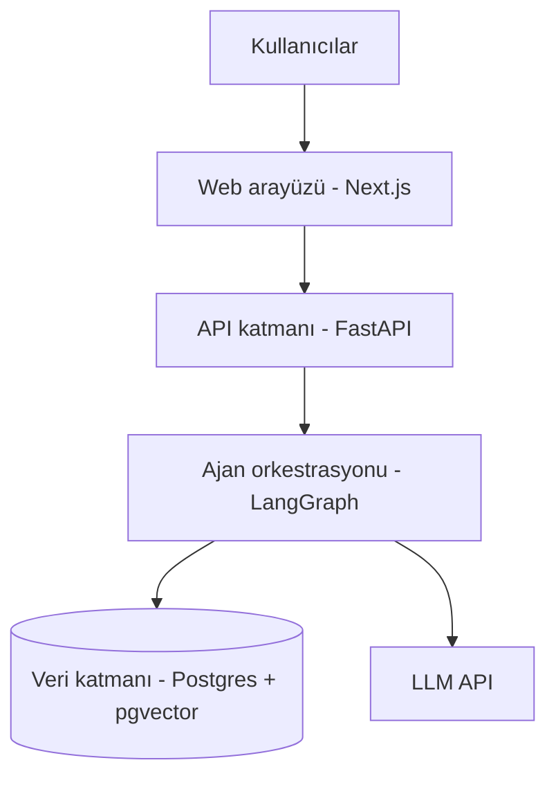

# [Proje Adı] — Zemin360 Hackathon

> Kurum–girişim ekosisteminde keşif, doğrulama, eşleşme ve iş birliği takibini tek bir paylaşılan veri katmanında birleştiren, altı uzman yapay zeka ajanından oluşan açık kaynak platform.

*(Proje adı henüz kesinleşmedi — repo'yu oluştururken bu başlığı güncelle.)*

## Bağlam

Bu proje, Türkiye Girişimcilik Vakfı (GİRVAK) tarafından İstanbul Kalkınma Ajansı (İSTKA) desteğiyle yürütülen **Zemin360** programının hackathonu için geliştirilmektedir. Program, kurumsal şirketler ile teknoloji tabanlı girişimler arasındaki iş birliklerini sistematik hale getirmeyi hedefliyor.

## Çözülen Problemler

Zemin360'ın tanımladığı altı problem alanının hepsine, tek bir paylaşılan profil–ihtiyaç grafiği üzerinden çalışan altı uzman ajanla çözüm üretiyoruz:

| # | Problem | Ajan |
|---|---|---|
| 1 | Genç Yeteneklerin Keşfi | Keşif Ajanı |
| 2 | Profil & Portfolyo Doğruluğu | Doğrulama Ajanı |
| 3 | Kurum–Kişi Akıllı Eşleşmesi | Eşleştirme Ajanı |
| 4 | Yaşayan Bir Ağ | Canlılık Ajanı |
| 5 | İhtiyaçların Net Tanımı | Tanımlama Ajanı |
| 6 | Şeffaf İş Birliği Takibi | Takip Ajanı |

Detaylı özellik tanımları için bkz. [`docs/agent-specs.md`](docs/agent-specs.md).

## Mimari

Detaylı mimari ve teknoloji kararları için bkz. [`docs/architecture.md`](docs/architecture.md).
Veri şeması için bkz. [`docs/data-schema.md`](docs/data-schema.md).
Uçtan uca akışlar için bkz. [`docs/sequence-diagrams.md`](docs/sequence-diagrams.md).
API yüzeyi için bkz. [`docs/api-contracts.md`](docs/api-contracts.md).

## Teknoloji Yığını

- **Backend:** Python, FastAPI
- **Ajan orkestrasyonu:** LangGraph (supervisor pattern, insan-onaylı durak noktaları)
- **Veritabanı:** PostgreSQL + pgvector
- **Frontend:** Next.js, Tailwind, shadcn/ui
- **Embedding:** Çok dilli embedding API'si (Türkçe destekli)
- **LLM:** Katmanlı model stratejisi — yapılandırma/çıkarma görevleri için hafif model, gerekçeli akıl yürütme için güçlü model

## Proje Durumu

🟡 **Tasarım aşaması** — mimari, veri şeması ve API sözleşmeleri tamamlandı; geliştirme Faz 1'de başlıyor.
Yol haritası ve faz planı için bkz. [`docs/roadmap.md`](docs/roadmap.md).

## Takım

- **Zühre Nur Korhan** — Teknik geliştirme, mimari
- **Pınar Vatansever** — Paydaş iletişimi, kurumsal koordinasyon

## Lisans

Bu proje [MIT Lisansı](LICENSE) ile açık kaynak olarak paylaşılmaktadır. *(GİRVAK ile imzalanacak hizmet sözleşmesindeki fikri mülkiyet şartlarına göre bu lisans güncellenebilir.)*
