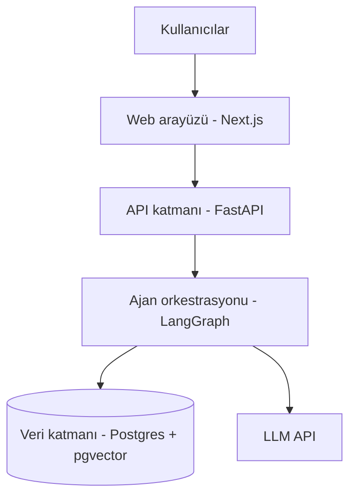

# [Proje Adı] — Zemin360 Hackathon

> Kurum–girişim ekosisteminde keşif, doğrulama, eşleşme ve iş birliği takibini tek bir paylaşılan veri katmanında birleştiren, altı uzman yapay zeka ajanından oluşan açık kaynak platform.

*(Proje adı henüz kesinleşmedi — repo'yu oluştururken bu başlığı güncelle.)*

## Bağlam

Bu proje, Türkiye Girişimcilik Vakfı (GİRVAK) tarafından İstanbul Kalkınma Ajansı (İSTKA) desteğiyle yürütülen **Zemin360** programının hackathonu için geliştirilmektedir. Program, kurumsal şirketler ile teknoloji tabanlı girişimler arasındaki iş birliklerini sistematik hale getirmeyi hedefliyor.

## Çözülen Problemler

Zemin360'ın tanımladığı altı problem alanının hepsine, tek bir paylaşılan profil–ihtiyaç grafiği üzerinden çalışan altı uzman ajanla çözüm üretiyoruz:

| # | Problem | Ajan |
|---|---|---|
| 1 | Genç Yeteneklerin Keşfi | Keşif Ajanı |
| 2 | Profil & Portfolyo Doğruluğu | Doğrulama Ajanı |
| 3 | Kurum–Kişi Akıllı Eşleşmesi | Eşleştirme Ajanı |
| 4 | Yaşayan Bir Ağ | Canlılık Ajanı |
| 5 | İhtiyaçların Net Tanımı | Tanımlama Ajanı |
| 6 | Şeffaf İş Birliği Takibi | Takip Ajanı |

Detaylı özellik tanımları için bkz. [`docs/agent-specs.md`](docs/agent-specs.md).

## Mimari



Detaylı mimari ve teknoloji kararları için bkz. [`docs/architecture.md`](docs/architecture.md).
Veri şeması için bkz. [`docs/data-schema.md`](docs/data-schema.md).
Uçtan uca akışlar için bkz. [`docs/sequence-diagrams.md`](docs/sequence-diagrams.md).
API yüzeyi için bkz. [`docs/api-contracts.md`](docs/api-contracts.md).
Eşleştirme algoritmasının detayı için bkz. [`docs/matching-algorithm.md`](docs/matching-algorithm.md).

## Teknoloji Yığını

- **Backend:** Python, FastAPI
- **Ajan orkestrasyonu:** LangGraph (supervisor pattern, insan-onaylı durak noktaları)
- **Veritabanı:** PostgreSQL + pgvector
- **Frontend:** Next.js, Tailwind, shadcn/ui
- **Embedding:** Voyage AI (voyage-4, 1024 boyut) — Anthropic'in Claude ile kullanım için resmi önerdiği sağlayıcı
- **LLM:** Katmanlı model stratejisi — yapılandırma/çıkarma görevleri için hafif model, gerekçeli akıl yürütme için güçlü model

## Backend'i Çalıştırma

Gereksinimler: Python 3.11+ ve **pgvector eklentisi kurulu** bir PostgreSQL (13+).

**1. Veritabanı.** pgvector'lu hazır bir Postgres'i Docker ile ayağa kaldırabilirsin:

```bash
docker run -d --name zemin360-db -e POSTGRES_PASSWORD=postgres -e POSTGRES_DB=zemin360 \
  -p 5432:5432 pgvector/pgvector:pg16
```

Kendi Postgres'ini kullanıyorsan `zemin360` veritabanını oluştur ve pgvector'ü kur (migration `CREATE EXTENSION vector` komutunu kendisi çalıştırır, ama eklenti dosyaları sunucuda kurulu olmalı).

<details>
<summary>Windows'a doğrudan kurulu Postgres'te pgvector (Docker kullanmıyorsan)</summary>

pgvector Windows için hazır ikili dağıtmıyor; Visual Studio derleyicisi ve Windows SDK ile kaynaktan derlemek gerekiyor:

```bash
git clone --branch v0.8.1 https://github.com/pgvector/pgvector.git
```

EDB'nin Windows derlemesinde `postgres.lib`, pgvector'ün ihtiyaç duyduğu `float_to_shortest_decimal_*` sembollerini dışarı açmıyor; bu yüzden bağlama adımı hata verir. Çözüm: aynı sürümün kaynağından (`postgresql-17.x/src/common/`) `f2s.c`, `ryu_common.h`, `d2s_intrinsics.h`, `digit_table.h` dosyalarını pgvector'ün `src/` klasörüne kopyalayıp `Makefile.win` içindeki `OBJS` listesine `src\f2s.obj` eklemek. Sonra VS geliştirici komut isteminde:

```
set PGROOT=C:\Program Files\PostgreSQL\17
nmake /F Makefile.win
nmake /F Makefile.win install      # yönetici gerekir
```

Bu kurulum **Faz 1 geliştirme makinesinde böyle yapıldı**; Docker kullanabiliyorsan yukarıdaki yol daha kısa.
</details>

**2. Bağımlılıklar ve ortam.**

```bash
cd backend
python -m venv .venv
.venv\Scripts\activate          # Windows  (macOS/Linux: source .venv/bin/activate)
pip install -e ".[dev]"
cp .env.example .env            # Windows PowerShell: Copy-Item .env.example .env
```

`.env` içindeki `DATABASE_URL`'i kendi bağlantına göre düzenle (async sürücü: `postgresql+asyncpg://...`). Gerçek `.env` commit edilmez.

**API anahtarları.** Sohbet ajanları (Keşif ve Tanımlama) iki dış servise gidiyor, ikisinin anahtarı da `.env`'de olmalı — yoksa sohbet ve kart onayı çalışmaz:

| Değişken | Ne için | Nereden |
|---|---|---|
| `GOOGLE_API_KEY` | Sohbet ve alan çıkarımı (Gemini 3.6 Flash, ücretsiz katman) | <https://aistudio.google.com/apikey> |
| `VOYAGE_API_KEY` | Kart onaylanınca embedding üretimi (voyage-4) | <https://dashboard.voyageai.com> |

Gemini'nin ücretsiz katmanında **model başına günde 20 istek** sınırı var (dakikalık sınır da ayrıca işliyor). Kota dolunca sohbet uç noktası `429` döner; sohbet checkpointer'da durduğu için kota yenilendiğinde aynı `oturum_id` ile kaldığın yerden devam edebilirsin. Bir sohbet yaklaşık 3-5 istek harcıyor, yani günde birkaç tam denemeye yetiyor. Kota model başına ayrı olduğu için ajan, ana modelin kotası dolduğunda otomatik olarak yedek modele (`GEMINI_YEDEK_MODEL`, varsayılan `gemini-3.1-flash-lite`) düşer; ikisi de dolarsa `429` görürsün.

**3. Migration ve sunucu.**

```bash
alembic upgrade head            # 11 tabloyu + pgvector eklentisini oluşturur
python run.py --reload          # http://localhost:8000
```

`run.py` yerine `uvicorn app.main:app` da çalışır — ama **Windows'ta `--reload` olmadan çalışmaz**: LangGraph'ın checkpointer'ı psycopg kullanıyor, psycopg de Windows'un varsayılan ProactorEventLoop'uyla uyumsuz. `run.py` döngüyü doğru olanla sabitliyor, sebebini de dosyanın başında anlatıyor.

- Sağlık kontrolü: <http://localhost:8000/health> → `{"status": "ok"}`
- Etkileşimli API dokümanı: <http://localhost:8000/docs>

**Yararlı komutlar** (`backend/` içinde):

```bash
pytest                                        # testler (DB ve API anahtarı gerektirmez)
python scripts/kesif_e2e.py                   # Keşif Ajanı uçtan uca (sunucu + gerçek API'ler)
python scripts/kesif_e2e.py b                 # sadece "hiç projem yok" senaryosu (kota tasarrufu)
python scripts/eslestirme_e2e.py <kurum_id> --tohum   # Eşleştirme pipeline'i uçtan uca
ruff check . && ruff format .                 # lint + format
alembic revision --autogenerate -m "mesaj"    # model değişikliğinden yeni migration
alembic check                                 # modeller ile migration arasında fark var mı?
```

**Ajan uç noktaları:** Doğrulama `POST /dogrulama/kanit-ekle`, `POST /dogrulama/referans-yaniti` (girişsiz, token ile), `POST /dogrulama/itiraz`, `GET /dogrulama/kanit/{somut_cikti_id}` · Keşif `/kesif/sohbet/baslat|cevap`, `/kesif/kart/onayla`, `GET /yetenek-kartlari/{id}` · Tanımlama `/tanimlama/sohbet/baslat|cevap`, `/tanimlama/kart/onayla`, `GET /ihtiyac-kartlari/{id}` · Eşleştirme `POST /eslestirme/calistir`, `GET /eslestirme/oneriler/{kurum_id}`, `POST /eslestirme/ilgileniyorum`. Tam liste: [`docs/api-contracts.md`](docs/api-contracts.md).

**Klasör yapısı:** `app/models/` (SQLAlchemy modelleri, tablo başına bir dosya) · `app/api/` (FastAPI router'ları) · `app/agents/` (`sohbet_motoru.py` ortak sohbet motoru + `kesif.py`, `tanimlama.py`, `eslestirme.py`, `dogrulama.py`) · `scripts/` (elle çalıştırılan denemeler) · `app/schemas/` (Pydantic şemaları) · `app/core/` (ayarlar) · `app/db/` (engine/session) · `alembic/` (migration'lar).

## Frontend'i Çalıştırma

Gereksinimler: Node.js 20.19+ (Next.js 16 en az 20.9 istiyor; shadcn CLI ve ESLint 20.19+ bekliyor).

```bash
cd frontend
npm install
cp .env.local.example .env.local   # Windows PowerShell: Copy-Item .env.local.example .env.local
npm run dev
```

Arayüz: <http://localhost:3000>

`.env.local` içindeki `NEXT_PUBLIC_API_URL`, backend'in adresidir (varsayılan `http://localhost:8000`). Ana sayfanın altındaki gösterge bu adrese `/health` isteği atar — **yeşilse** iki taraf konuşuyor, **kırmızıysa** backend kapalı ya da CORS ayarı eksik demektir. Backend'i de çalıştırmayı unutma.

**Yararlı komutlar** (`frontend/` içinde):

```bash
npm run dev       # geliştirme sunucusu
npm run build     # üretim derlemesi + tip kontrolü
npm run lint      # ESLint
npx shadcn@latest add <bilesen>   # yeni shadcn/ui bileşeni ekle
```

**Klasör yapısı:** `src/app/` (App Router sayfaları) · `src/components/ui/` (shadcn/ui bileşenleri — elle düzenlenebilir) · `src/components/` (kendi bileşenlerimiz) · `src/lib/api.ts` (backend fetch sarmalayıcısı).

**Notlar:**
- **Tema** [`docs/design-language.md`](docs/design-language.md)'den geliyor: palet `src/app/globals.css` içindeki CSS değişkenlerinde, fontlar (Fraunces + IBM Plex Sans) `src/app/layout.tsx` içinde tanımlı. Renk veya font değiştireceksen önce o belgeye bak.
- shadcn/ui, **Radix** tabanlı kurulumla (`nova` preset, Lucide ikonları) eklendi — `components.json` bunu kaydeder. Şu an sadece `button`, `input`, `card` kurulu. Yeni bileşenler shadcn'in varsayılan renkleriyle değil, paletteki değişkenlerle gelir.
- `/kesif` ve `/tanimlama` sayfaları çalışan sohbet arayüzleri: sohbet → taslak → onay formu → kaydedilen kart. Ortak görsel parçalar `src/components/sohbet.tsx` içinde.

## Proje Durumu

🟢 **Faz 2 sürüyor** — altı ajandan üçü çalışıyor:

| Ajan | Durum |
|---|---|
| **Keşif** | Çalışıyor — sohbet → yetenek kartı taslağı → onay → kayıt + embedding |
| **Tanımlama** | Çalışıyor — sokratik sohbet → ihtiyaç kartı taslağı → onay → kayıt + embedding |
| **Eşleştirme** | Çalışıyor (backend) — sert filtre → pgvector benzerliği → skor → gerekçe → iş birliği |
| **Doğrulama** | Çalışıyor (backend) — kanıt kontrolü + rubrik → referans akışı → itiraz |
| Canlılık, Takip | Faz 3 |

**Doğrulama kapsamı:** e-posta göndermiyoruz (SMTP yok) — referans linki API yanıtında dönüyor, referans kişiye elle iletilir. Zaman aşımı (7 gün) için zamanlayıcı da yok: `bekliyor` → `yanit_yok` geçişi kanıt durumu okunduğunda hesaplanıyor. İkisi de bilinçli MVP kararı.

**Eşleştirme kapsamı:** şu an yalnızca kurum tarafı var (öneri listesi + "ilgileniyorum" → `ISBIRLIGI`). Genç'in eşleşme bildirimini görmesi ve arayüzü bilinçli olarak ertelendi (Faz 3+). Skor formülünün ESCO taksonomi bileşeni de MVP dışında (bkz. `docs/matching-algorithm.md`).

İki sohbet ajanı aynı motoru paylaşıyor (`backend/app/agents/sohbet_motoru.py`): grafik iskeleti, taslak birleştirme ve yedek modele düşen LLM zinciri orada; soru seti, çıkarım şeması ve ajana özel dallar ajan dosyasında.

Sırada: Canlılık ve Takip ajanları, bir de Eşleştirme/Doğrulama'nın arayüzü.
Yol haritası ve faz planı için bkz. [`docs/roadmap.md`](docs/roadmap.md).

## Takım

- **Zühre Nur Korhan** — Teknik geliştirme, mimari
- **Pınar Vatansever** — Paydaş iletişimi, kurumsal koordinasyon

## Lisans

Bu proje [MIT Lisansı](LICENSE) ile açık kaynak olarak paylaşılmaktadır. *(GİRVAK ile imzalanacak hizmet sözleşmesindeki fikri mülkiyet şartlarına göre bu lisans güncellenebilir.)*
