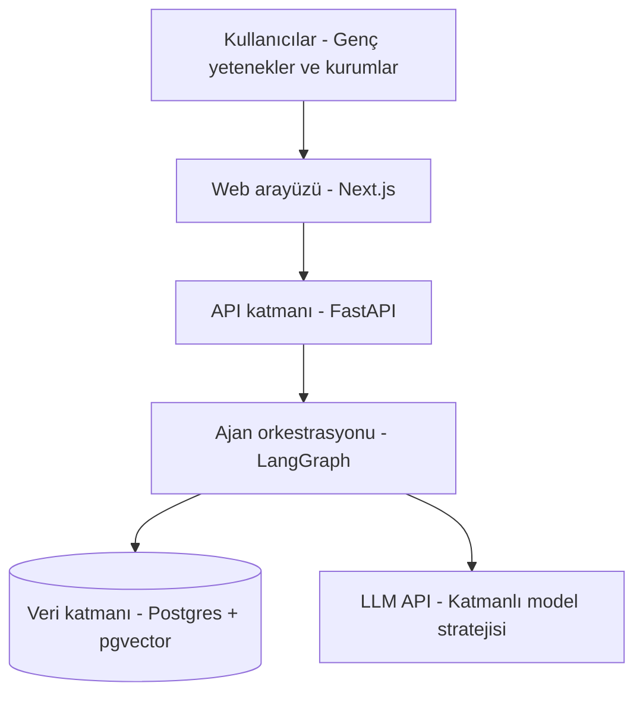

# Mimari

## Genel Bakış

Sistem, ortak bir veri katmanı üzerinde çalışan altı uzman ajandan oluşuyor. Hiçbir ajan diğerinin işini bloklamıyor — Keşif/Tanımlama akışları kullanıcı etkileşimine bağlı senkron çalışırken, Eşleştirme ve Canlılık ajanları arka plan işleri (background jobs) olarak tasarlanıyor.



## Teknoloji Kararları

| Katman | Seçim | Gerekçe |
|---|---|---|
| Ajan orkestrasyonu | **LangGraph** | Durum kalıcılığı (checkpointing) ve insan-onay noktalarını (interrupt) native destekliyor — Keşif, Doğrulama ve Eşleştirme ajanlarının hepsinde bir onay/itiraz durağı var. CrewAI/AutoGen'e göre bu ihtiyaca en uygun olanı. |
| Backend | **FastAPI (Python)** | Orkestrasyon katmanıyla aynı dilde, async destekli; bu sınıf ürünlerde sektörün en yaygın kombinasyonu. |
| Veritabanı | **PostgreSQL + pgvector** | Ayrı bir vektör veritabanı (Qdrant/Pinecone) bu veri hacminde (yüzlerce–birkaç bin kayıt) gereksiz altyapı yükü. Tek veritabanında hem ilişkisel veri hem embedding tutuluyor. |
| Frontend | **Next.js + Tailwind + shadcn/ui** | Güncel, hızlı ve profesyonel görünümlü bir arayüz için sektör standardı — UI/UX değerlendirme kriterini doğrudan destekliyor. |
| Embedding | **Voyage AI (voyage-4, 1024 boyut)** | Anthropic'in Claude ile kullanım için resmi önerdiği sağlayıcı — aynı ekosistem, ilk 200M token ücretsiz (hackathon için pratikte sıfır maliyet). |

## LLM Maliyet/Performans Stratejisi

Görevler üç kategoriye ayrılıyor, her biri farklı model gerektiriyor:

1. **Yapılandırma/çıkarma** (Keşif ve Tanımlama sohbetleri) → hafif/hızlı model yeterli — format zaten net, ince akıl yürütme gerekmiyor.
2. **Gerekçeli akıl yürütme** (Eşleştirme'nin "neden eşleşti" açıklaması, Doğrulama'nın rubrik puanlaması) → orta-güçlü model gerekli — nüans burada önemli.
3. **Embedding** → modelden bağımsız, ayrı ve ucuz bir çağrı.

Bu katmanlama, maliyetin büyük kısmını ucuz modelde tutarken kalite gereken yerde güçlü modeli devreye sokuyor. Geliştirme sırasında mock veriyle test edilip gerçek API çağrısı sadece gerekli anlarda yapılarak kredi korunmalı.

## Repo Yapısı

```
/docs               — bu klasör: mimari, şema, API sözleşmeleri, yol haritası
/backend            — FastAPI + LangGraph (Faz 1'de dolacak)
/frontend           — Next.js (Faz 1'de dolacak)
```

Monorepo tercih edildi — solo geliştirici + 3 haftalık sprint için ayrı repolar arası senkronizasyon yükü gereksiz.
