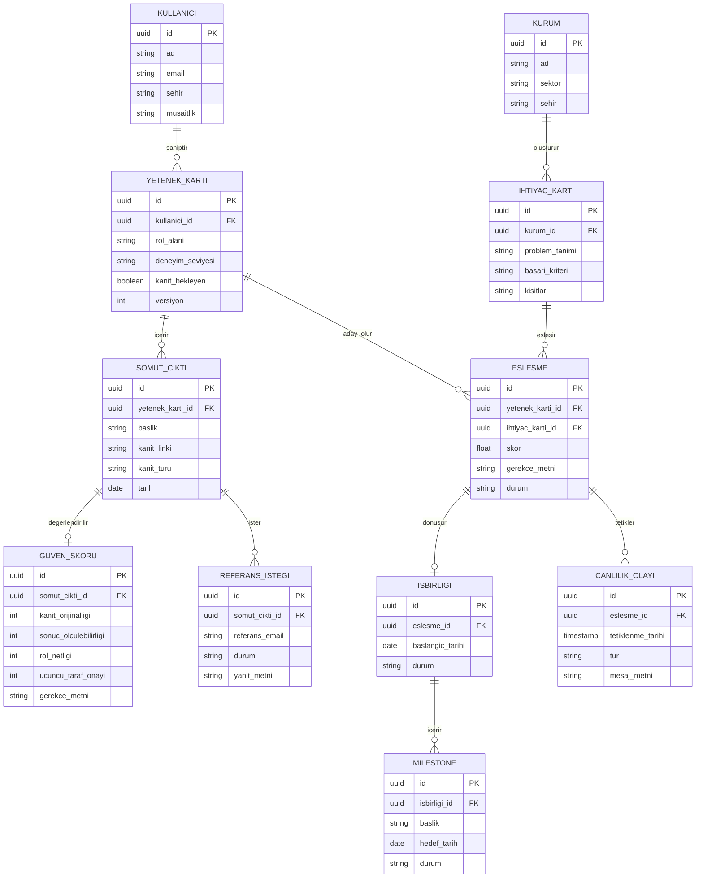

# Veri Şeması

## ER Diyagramı

## Tasarım Kararları

- **`GUVEN_SKORU` ve `REFERANS_ISTEGI`, `SOMUT_CIKTI`'dan ayrı tablolar.** Bir çıktının birden fazla referans isteği olabilir; güven skoru zamanla güncellenebilir olmalı (itiraz sonrası yeniden hesaplama).
- **`ESLESME` → `ISBIRLIGI` ilişkisi isteğe bağlı (0 veya 1).** Her eşleşme iş birliğine dönüşmez — sadece kurumun "ilgileniyorum" dediği ve kabul edilen eşleşmeler.
- **`CANLILIK_OLAYI` doğrudan `ESLESME`'ye bağlı, `ISBIRLIGI`'na değil.** Pasiflik takibi bir iş birliği resmen başlamadan da çalışabilmeli — örn. "eşleşme önerildi ama kimse tıklamadı" durumu.
- **`kanit_bekleyen` (YETENEK_KARTI) ve `durum` (REFERANS_ISTEGI, ESLESME, ISBIRLIGI) alanları state machine mantığıyla çalışıyor.** Örn. `REFERANS_ISTEGI.durum`: `bekliyor` → `onaylandi` veya `yanit_yok` (zaman aşımı, ceza değil nötr durum).
