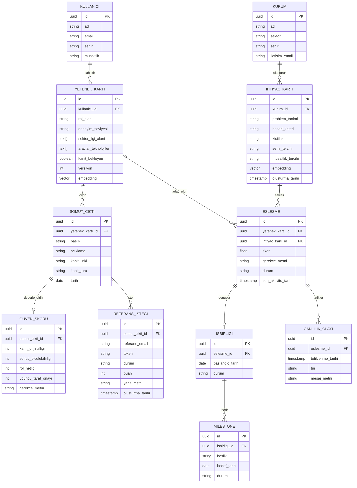

# Veri Şeması

## ER Diyagramı

## Tasarım Kararları

- **`GUVEN_SKORU` ve `REFERANS_ISTEGI`, `SOMUT_CIKTI`'dan ayrı tablolar.** Bir çıktının birden fazla referans isteği olabilir; güven skoru zamanla güncellenebilir olmalı (itiraz sonrası yeniden hesaplama).
- **`ESLESME` → `ISBIRLIGI` ilişkisi isteğe bağlı (0 veya 1).** Her eşleşme iş birliğine dönüşmez — sadece kurumun "ilgileniyorum" dediği ve kabul edilen eşleşmeler.
- **`CANLILIK_OLAYI` doğrudan `ESLESME`'ye bağlı, `ISBIRLIGI`'na değil.** Pasiflik takibi bir iş birliği resmen başlamadan da çalışabilmeli — örn. "eşleşme önerildi ama kimse tıklamadı" durumu.
- **`kanit_bekleyen` (YETENEK_KARTI) ve `durum` (REFERANS_ISTEGI, ESLESME, ISBIRLIGI) alanları state machine mantığıyla çalışıyor.** Örn. `REFERANS_ISTEGI.durum`: `bekliyor` → `yanitlandi` veya `yanit_yok` (zaman aşımı, ceza değil nötr durum). `yanitlandi`, referansın yanıt verdiğini söyler — olumlu bulduğunu değil; olumsuz bir referans da bu durumda olur, değerlendirme `GUVEN_SKORU.ucuncu_taraf_onayi` puanında taşınır.
- **`embedding` (YETENEK_KARTI, IHTIYAC_KARTI), pgvector kolonu.** Kart onaylandığında/güncellendiğinde yeniden hesaplanır. **Sağlayıcı: Voyage AI (voyage-4, 1024 boyut)** — Anthropic'in Claude ile kullanım için resmi önerisi; ilk 200M token ücretsiz. `EMBEDDING_DIM = 1024` olarak sabitlenir (bkz. `matching-algorithm.md`).
- **`sehir_tercihi` ve `musaitlik_tercihi` (IHTIYAC_KARTI), nullable.** Eşleştirme'nin sert filtre adımı SQL üzerinden çalışabilsin diye — serbest metin `kisitlar` alanı bu amaçla sorgulanamaz. `IHTIYAC_KARTI.sehir_tercihi` ile `KURUM.sehir` farklı şeyler: ilki gencin nerede olması istendiği (filtre), ikincisi kurumun kendi yeri (filtre değil). Arayüzde "aranan şehir" ve "kurumun şehri" olarak ayrı ayrı soruluyor; tercih boşsa kurumun şehri varsayılan geliyor.
- **Şehir adları kanonik yazımda saklanıyor** (`app/core/sehir.py`, 81 il + `uzaktan`). Sebep: filtre düz string karşılaştırması ve Türkçe'de `'istanbul' = 'İstanbul'` false — `lower()` ve `ILIKE` de çözmüyor (Postgres bu collation'da İ'yi küçültmüyor, Python'ın `lower()`'ı ise i + U+0307 üretiyor). Kayıt anında `sehir_kanonik()` uygulanıyor, eski satırlar `a1c4f7e2b903` migration'ıyla düzeltildi. `uzaktan` değeri gençte "her şehirden çalışırım", ihtiyaç kartında "şehir filtresi uygulama" demek.
- **`sektor_ilgi_alani`, `araclar_teknolojiler` (YETENEK_KARTI), `aciklama` (SOMUT_CIKTI), `token` (REFERANS_ISTEGI).** Faz 1'de backend iskeletini yazarken Claude Code'un dokümanlar arası çapraz kontrolde yakaladığı eksiklerdi — diğer dosyalar (`agent-specs.md`, `matching-algorithm.md`, `api-contracts.md`) bu alanlara referans veriyordu ama ER diyagramında yoktu. Buradan eklendi.
- **`iletisim_email` (KURUM).** `KULLANICI.email`'in kurum karşılığı — Keşif Ajanı'nda kart onaylanırken email üzerinden `Kullanici` bulunup/oluşturuluyordu, Tanımlama Ajanı'nda `Kurum` için aynı mekanizma gerekiyor. Tanımlama Ajanı'nın backend'i yazılırken fark edildi.
- **`puan` (REFERANS_ISTEGI) ve çok referanslı hesap.** Referansın 1-5 puanı kaydediliyor, çünkü `GUVEN_SKORU.ucuncu_taraf_onayi` tek bir yanıttan değil, **yanıtlamış tüm referansların ortalamasından** hesaplanıyor (1-5 → 0-3 çevrimi sonrası, 0.5 yukarı yuvarlanarak). En yüksek puanı almak "olumlu diyen birini bulana kadar referans sor" davranışını ödüllendirirdi; ortalama, zayıf bir referansın puanı aşağı çekmesine izin verir. Yuvarlama aşağı değil normal: aşağı yuvarlamada iki güçlü referans (5+4 → 2.5 → 2) tek bir 5'ten (3) düşük puan alıyordu — referans eklemek iddiayı zayıflatmamalı. Puan saklanmadan bu hesap yapılamıyordu — son yanıt öncekinin üzerine yazıyordu. Doğrulama Ajanı denenirken fark edildi.
- **`olusturma_tarihi` (REFERANS_ISTEGI).** Zaman aşımı dalı (`bekliyor` → `yanit_yok`, 5-7 gün) bir tarih olmadan hesaplanamıyordu. Ayrı bir zamanlayıcı kurulmadığı için bu geçiş okuma anında hesaplanıyor; alan onun dayanağı. Doğrulama Ajanı yazılırken eklendi.
- **`olusturma_tarihi` (IHTIYAC_KARTI).** Eşleştirme Ajanı "kurumun en son ihtiyaç kartı"nı bulmak için `id` sırasına bakıyordu — ama `id` rastgele üretilen bir UUID (v4), zaman bilgisi taşımıyor, sıralaması kronolojik değil. Eşleştirme Ajanı yazılırken fark edildi, gerçek bir tarih alanıyla düzeltiliyor.
