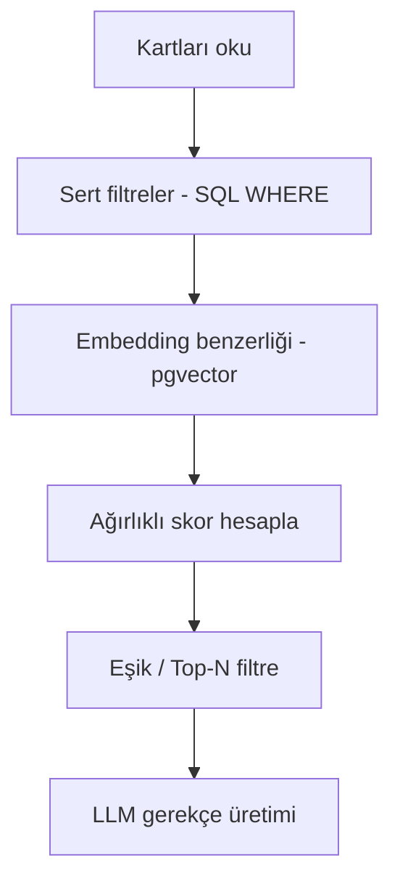

# Eşleştirme Algoritması

Bu doküman, `agent-specs.md`'deki 7 adımlı pipeline'ın uygulama düzeyinde detayıdır. Kapsam iki katmana ayrılmıştır: **MVP çekirdek** (Faz 2'de yazılacak, ESCO taksonomisi olmadan çalışır) ve **isteğe bağlı geliştirme** (zaman kalırsa eklenir). Bu ayrım bilinçli — projenin en riskli parçasını önce en sade haliyle çalışır kılmak, sonra zenginleştirmek.



## 1. Temsil Metni (embedding'e hazırlama)

Her kart, embedding'e verilmeden önce tek bir düz metne dönüştürülür.

**Yetenek kartı şablonu:**
```
Rol: {rol_alani}
Deneyim: {deneyim_seviyesi}
Sektör ilgisi: {sektor_ilgi_alani}
Araçlar: {araclar_teknolojiler}
Öne çıkan çıktılar: {somut_ciktilar[].baslik ve aciklama, birleştirilmiş}
```

**İhtiyaç kartı şablonu:**
```
Problem: {problem_tanimi}
Başarı kriteri: {basari_kriteri}
```

## 2. Embedding Üretimi

- Temsil metni, Voyage AI'nin `voyage-4` modeline gönderilir (1024 boyut) — Anthropic'in Claude ile kullanım için resmi önerdiği sağlayıcı, ilk 200M token ücretsiz.
- Sonuç vektör, kartın `embedding` kolonuna yazılır (pgvector).
- **Ne zaman yeniden hesaplanır:** kart onaylandığında (ilk oluşturma) ve her güncellemede (`versiyon` arttığında).

## 3. Sert Filtreler (embedding'den ÖNCE çalışır)

```sql
SELECT yk.* FROM yetenek_karti yk
JOIN kullanici k ON k.id = yk.kullanici_id
WHERE (ih.musaitlik_tercihi IS NULL OR k.musaitlik = ih.musaitlik_tercihi)
  AND (ih.sehir_tercihi IS NULL OR k.sehir = ih.sehir_tercihi)
```

Bu adım havuzu daralttıktan sonra benzerlik hesabı sadece bu alt kümede çalışır — hem doğru hem performanslı.

## 4. Skor Formülü (MVP — ESCO'suz)

```
skor = 0.75 * cosine_similarity(yetenek.embedding, ihtiyac.embedding)
     + 0.25 * dogrulama_bonus
```

`dogrulama_bonus` hesabı:
- `GUVEN_SKORU` kaydı varsa: `(kanit_orijinalligi + sonuc_olculebilirligi + rol_netligi + ucuncu_taraf_onayi) / 12` (0-1 arası normalize)
- Kayıt yoksa (henüz doğrulanmamış): `0` — **ceza değil**, sadece bonus yok. Doğrulanmamış kart elenmez, listede kalır.

## 5. Eşik ve Sıralama

Mutlak bir eşik yerine (havuz küçükken saçmalar) **Top-N** yaklaşımı: en yüksek skorlu **5 sonuç** gösterilir. Ek güvenlik: skor %40'ın altındaysa hiç gösterilmez (tamamen alakasız sonuçları filtrelemek için).

**Cold start:** havuzda az kart varken bu doğal bir sınırlama — arayüzde gizlenmez, açıkça belirtilir: *"Şu an sınırlı sayıda eşleşme var."*

## 6. Gerekçe Üretimi (LLM)

LLM'e verilenler: ihtiyaç kartı özeti, yetenek kartı özeti, doğrulama durumu. İstenen çıktı: 2-3 cümlelik, somut noktalara referans veren bir gerekçe — genel geçer ifadeler değil ("iyi bir aday" gibi), kartlardaki gerçek alanlara atıf yapan cümleler.

## İsteğe Bağlı Geliştirme — ESCO Taksonomi Eşleme

Zaman kalırsa (Faz 3 veya sonrası), skor formülüne bir bileşen daha eklenir:

```
skor = 0.55 * cosine_similarity
     + 0.20 * esco_orani
     + 0.25 * dogrulama_bonus
```

`esco_orani`: kartların serbest metnindeki beceri ifadelerinin, ESCO'nun Türkçe beceri listesiyle embedding benzerliği üzerinden eşlenen oranı (LLM çağrısı gerektirmeyen, daha ucuz bir yöntem — kart metni değil, tekil beceri ifadeleri ESCO terimleriyle karşılaştırılır).

**Bu adım MVP'yi bloklamaz** — cosine similarity zaten kartın tamamındaki serbest metni temsil ettiği için, ESCO olmadan da anlamlı eşleşmeler üretir.
