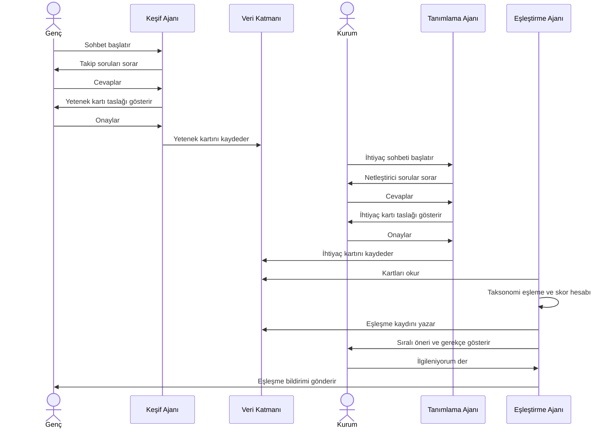
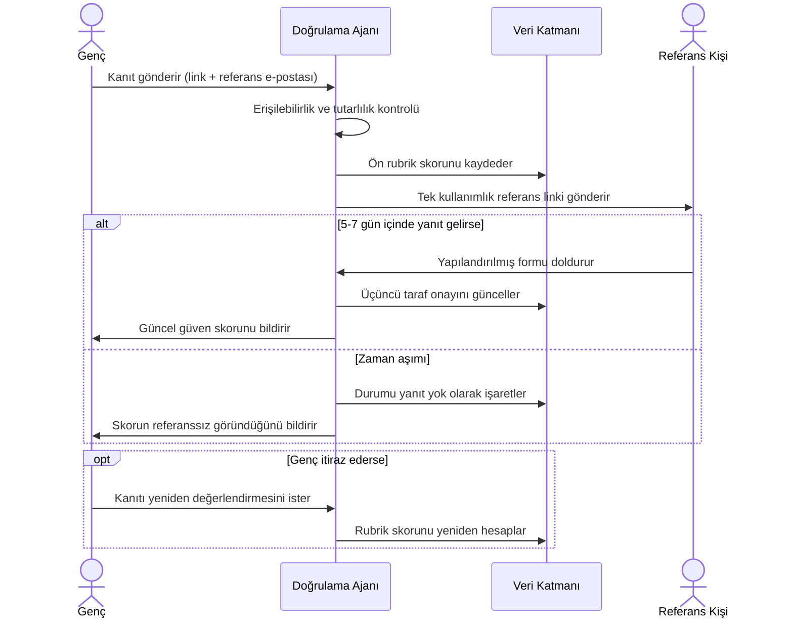

# Sequence Diyagramları

## Akış 1 — Keşif → Tanımlama → Eşleştirme (happy path)

Genç ve kurum akışları birbirinden bağımsız çalışır; aynı anda platformda olmaları gerekmez. Eşleştirme Ajanı ikisini de arka planda periyodik/tetiklemeli okur.

**Mimari sonucu:** Eşleştirme Ajanı senkron bir endpoint değil, ayrı bir arka plan işi (background job / cron) olarak yazılmalı.

## Akış 2 — Doğrulama (referans + zaman aşımı dalı)

Zaman aşımı bir hata değil, tasarlanmış bir dal — kişiyi cezalandırmayan nötr bir durum olarak modellenmeli.

**Mimari sonucu:** Referans yanıt endpoint'i (`/dogrulama/referans-yaniti`) token bazlı ve girişsiz olmalı — referans kişiyi üye olmaya zorlamak yanıt oranını düşürür.
